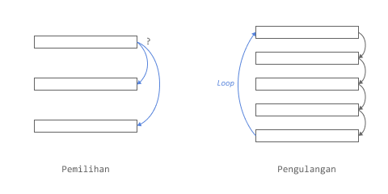

# Control Flow
Pada kehidupan nyata terkadang kita perlu membuat keputusan dan apa yang harus dilakukan berdasarkan keputusan tersebut. Atau kita melakukan pekerjaan yang sama dan berulang.

Hal serupa juga ada dalam pemrograman, dimana kita perlu membuat keputusan atau mengulang pekerjaan yang sama. Istilah tersebut yaitu **pemilihan (_selection_)** dan **pengulangan (_looping/repetition_)**.

<div align="center">
    
</div>

#### Contoh 1. Algoritma menentukan bilangan ganap/ganjil
```
Langkah 1 - MULAI
Langkah 2 - Deklarasikan variabel bilangan n
Langkah 3 - Tentukan nilai n
Langkah 4 - JIKA n % 2 sama dengan 0, MAKA
                Cetak n + " adalah bilangan Genap"
Langkah 5 - JIKA TIDAK, MAKA
                Cetak n + " adalah bilangan Ganjil"
Langkah 6 - SELESAI
```